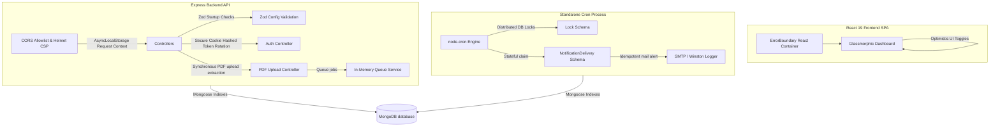

# 🎓 AI Study Planner — Smart Adaptive Learning & Schedule Assistant

<div align="center">
  <br />
  
  [](https://react.dev)
  [](https://nodejs.org)
  [](https://groq.com)
  
  <br />
  
  <a href="https://github.com/beingUbaid/AI-Study-Planner">
    
  </a>
</div>

---

## 📖 Project Overview

**AI Study Planner** is a production-grade adaptive educational platform designed to help students convert unstructured lecture course syllabi into optimized, structured study schedules. The system leverages:
1. **Deterministic Spaced-Repetition Scheduling:** An algorithmic scheduling core implementing Leitner Box methodologies and topological dependency sorting.
2. **AI-Assisted Operations:** Generates quiz explanations, interactive flashcards, chatbot tutors, and schedule descriptions.

---

## 🔄 System Architecture & Data Flow



---

## 🌟 Key Architecture Subsystems

### 1. Deterministic Scheduling Engine
Unlike unpredictable LLM-generated calendars, this platform implements a fully deterministic scheduler:
* **Prerequisites Topological Sort:** Analyzes chapter dependencies, ensuring foundational concepts are scheduled before advanced subjects.
* **Leitner Box Spaced Repetition:** Calibrates daily workloads based on student quiz scores, reducing load for mastered topics (-50% estimated hours) and scaling up for difficult ones (+30%).
* **Burnout & Break Guardrails:** Automatically schedules break days every 7th day and monitors daily densities.

### 2. LLM Boundary & Zod Validation Retries
* **Structured JSON Mode:** Enforces JSON responses from Groq APIs verified against Zod schemas (with character limits, unique option array lengths, and index ranges).
* **Agentic Error Feedback Loops:** If a schema validation fails, the validation error is appended to the message history, letting the LLM self-correct on subsequent retries.
* **Controlled Fallbacks:** Standardizes UI layouts via fallback responses if the retry threshold is exceeded.

### 3. Hashed Refresh Token Families
* **Token Rotation (RTR):** Stores cryptographically hashed SHA-256 signatures of refresh tokens in a dedicated collection.
* **Theft Replay Lockout:** Generates linked `familyId` token lineages. If a reused refresh token is presented, the entire family is revoked, force-logging out the student.

### 4. Background Worker & Idempotent Reminders
* **Graceful Decoupling:** Decouples daily cron checks into a standalone `worker.js` node instance.
* **Distributed DB Locks:** Leverages a `Lock` schema with MongoDB TTL indexes to ensure only one worker executes reminders.
* **Recipient Idempotency:** Implements a stateful `NotificationDelivery` claim index matching unique user and calendar day scopes.

---

## 📁 Repository Structure

```
AI-Study-Planner/
├── backend/
│   ├── src/
│   │   ├── config/           # Database connections & Zod startup environment schemas
│   │   ├── controllers/      # Resource ownership controllers (Auth, AI, Subjects)
│   │   ├── middleware/       # Rate limiting, Request validation, and custom CORS configurations
│   │   ├── models/           # Hashed tokens, NotificationClaim, Locks, and database indexes
│   │   ├── routes/           # REST API routes
│   │   ├── services/         # Token handling, callLLM retries, and queue services
│   │   └── utils/            # Winston structured logging, sendEmail, and planner logic
│   ├── tests/                # Jest & Supertest integration suite (auth, scheduler)
│   ├── index.js              # API Entrypoint
│   └── worker.js             # Standalone background cron job worker
├── frontend/
│   ├── src/
│   │   ├── components/       # UI Components, page layouts, skeletons, and Error Boundaries
│   │   ├── context/          # State management (Theme, Auth)
│   │   └── services/         # Axios interceptors handling token rotation transparently
│   └── vercel.json           # SPA redirect rules configuration
```

---

## ⚙️ Running Locally

### 1. Setup Backend
Use reproducible `npm ci` commands:
```bash
cd backend
npm ci
cp .env.example .env
# Configure JWT_SECRET (32+ chars), MONGO_URI, and GROQ_API_KEY
npm run dev
```

To boot the worker in a separate standalone terminal process:
```bash
cd backend
node worker.js
```

### 2. Setup Frontend
```bash
cd ../frontend
npm ci
cp .env.example .env
# Verify VITE_API_URL is configured
npm run dev
```

---

## 🧪 Testing Suites

Run backend automated Jest and Supertest integration tests:
```bash
cd backend
npm test
```

Run frontend Vitest unit tests:
```bash
cd frontend
npm run test
```

Run Playwright End-to-End browser integration tests:
```bash
cd frontend
npx playwright test
```

---

## 🐳 Docker Deployment Stack

To spin up the entire production container stack locally (incorporating health checks, alpine environments, and non-root executors):
```bash
docker-compose up --build
```
