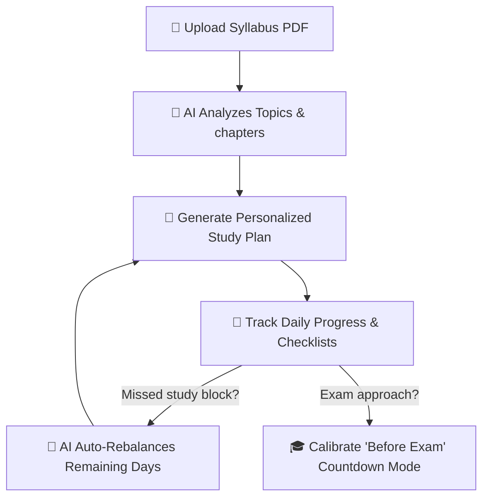

# 🎓 AI Study Planner — Smart Adaptive Learning & Schedule Assistant

<div align="center">
  <br />
  
  [](https://react.dev)
  [](https://nodejs.org)
  [](https://groq.com)
  
  <br />
  
  <a href="https://ai-study-planner.vercel.app">
    
  </a>
  <a href="https://github.com/beingUbaid/AI-Study-Planner">
    
  </a>
</div>

---

## 📖 Project Overview

**AI Study Planner** is a modern full-stack, AI-powered productivity platform designed to help students transform complex, unstructured course syllabi into adaptive, optimized study blueprints. Using state-of-the-art LLMs, the platform identifies chapters, suggests study hour distributions, structures active-recall flashcards/quizzes, and dynamically rebalances study tasks when deadlines are missed.

### 🔄 How It Works



---

## 🔐 Demo Credentials

Skip registration and explore the platform instantly using the credentials below:

- **Email**: `demo@example.com`
- **Password**: `Password123`

---

## 🌟 Key Features

### 1. 🤖 Adaptive AI Schedule Generation & Plan Rebalancing
* **Syllabus Parser**: Drag & drop a syllabus PDF (up to 10MB). Groq AI extracts chapter titles and schedules study days.
* **Study Blueprint Explanation**: Each plan generated is backed by a bulleted AI logic card detailing why chapters were mapped to specific dates.
* **Auto-Rebalancing Engine**: Tutors classify student queries (e.g. *"I missed yesterday's study"*) and automatically shift uncompleted study blocks forward into future days.

### 2. ⚡ AI Active-Recall Flashcards & Self-Testing Quizzes
* **3D Flip Flashcards**: Generate high-yield study cards for active recall.
* **Self-Evaluation Quizzes**: Take interactive multiple-choice practice quizzes with step-by-step AI answer explanations.

### 3. 🎙️ Voice-Activated AI Study Chatbot
* Speak queries hands-free. The tutor responds with academic definitions and embedded YouTube video lectures.

### 4. 🎯 "Before Exam" Countdown Mode
* Select an exam date and subjects to generate a high-intensity study roadmap block-by-block leading up to test day.

### 5. 📊 Analytics, Streaks & Mastery Logs
* **AI recommendations**: 3 dynamic performance cards suggesting revision shifts.
* **Cognitive Safety Meter**: Gauge fatigue indices based on pending tasks and hours.

---

## 🛠️ Tech Stack

* **Frontend**: React 19 (Vite), Tailwind CSS (Glassmorphic Theme), Lucide Icons
* **Backend**: Node.js & Express, MongoDB Atlas & Mongoose, Passport.js (JWT)
* **AI Model**: Groq SDK (`llama-3.1-8b-instant`)

---

## 📁 Repository Structure

```
AI-Study-Planner/
├── backend/
│   ├── src/
│   │   ├── controllers/      # Auth, AI, Subject, Planner, Progress controllers
│   │   ├── middleware/       # JWT Auth Middleware
│   │   ├── models/           # Mongoose Schemas (User, Subject, Chapter, StudyPlan)
│   │   ├── routes/           # REST API Route Definitions
│   │   └── utils/            # Schedule generation & Email sending utilities
│   ├── tests/                # Unit test suites (planner.test.js)
│   └── index.js              # Server entry point
│
├── frontend/
│   ├── src/
│   │   ├── components/       # Reusable UI components (Logo, Pomodoro, Sidebar)
│   │   ├── pages/            # Views (Dashboard, CalendarPlanner, StudyTracker, Exams)
│   │   └── services/         # Centralized API service methods
│   └── index.html            # Vite HTML entry point
```

---

## ⚙️ How to Run Locally

### 1. Clone Repository
```bash
git clone https://github.com/beingUbaid/AI-Study-Planner.git
cd AI-Study-Planner
```

### 2. Configure Backend
```bash
cd backend
npm install
cp .env.example .env
# Edit .env and supply your MONGO_URI, JWT_SECRET, and GROQ_API_KEY
npm run dev
```

### 3. Configure Frontend
```bash
cd ../frontend
npm install
cp .env.example .env
# Edit .env and point VITE_API_URL to http://localhost:5000/api
npm run dev
```

---

## 🧪 Testing

Run backend scheduler unit tests locally:
```bash
cd backend
node tests/planner.test.js
```

---

## 📄 License
This project is licensed under the **MIT License**.
