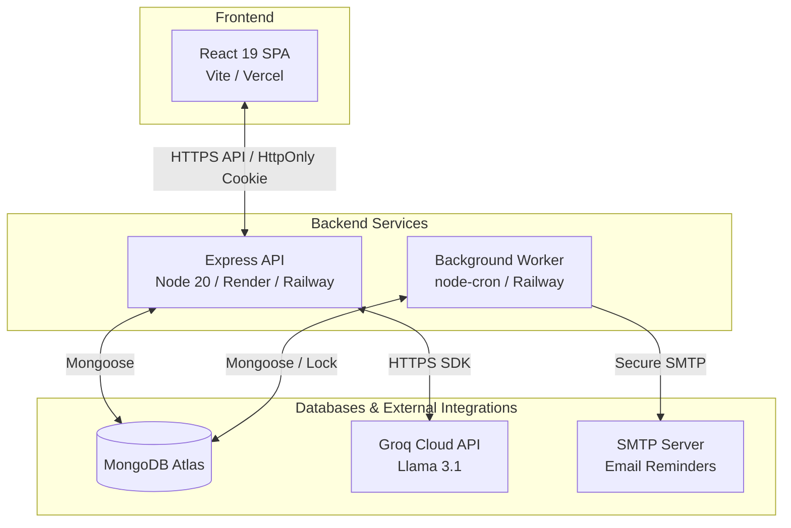

# 🎓 AI-Powered Adaptive Study Planner

GitHub About: "AI-powered adaptive study planner with syllabus parsing, deterministic scheduling, quizzes, flashcards, progress analytics and automatic plan rebalancing"

Live Deployment URL: https://your-deployment-url.vercel.app  
Topics: `react`, `vite`, `nodejs`, `express`, `mongodb`, `groq`, `generative-ai`, `edtech`, `study-planner`, `jest`, `vitest`, `playwright`, and `docker`.

---

## 🏗️ Architecture & Flow



The system consists of separate, decoupled **API** and **Worker** services sharing a single **MongoDB** state store:
1. **API Service**: Exposes user authentication, analytics, syllabus uploads, chatbot, and planner endpoints.
2. **Worker Service**: Standalone process running Daily Exam Reminders using node-cron with distributed locks and idempotent delivery state controls.

---

## 📖 System Design: Deterministic Sort vs. LLM

The application draws a strict boundary between deterministic calculations and creative LLM generation:
*   **Deterministic Scheduling Engine**: Written in pure JavaScript (`plannerLogic.js`). Arranges chapters based on Leitner Box spaced repetition priorities, sorts topics topologically using user-defined prerequisites, inserts mandatory break days, and dynamically compresses tasks as exam dates approach. It never calls an LLM, making scheduling fast, repeatable, and fully unit-testable.
*   **LLM Assistance Layer**: Interacts with Groq API (`llama-3.1-8b-instant`). Used exclusively for syllabus text parsing, flashcard/quiz generation, study chatbot context replies, and text schedule explanations. Zod validation schemas are enforced on all LLM responses, running an auto-correction feedback retry loop.

---

## ⏰ Notification Idempotency & Bounded Retry Flow

To handle concurrent worker pods and prevent duplicate emails:
1. **Normalized Delivery Key**: Every notification creates a deterministic `idempotencyKey` formatted as `userId:subjectId:taskId:reminderType:scheduledDate`. A unique MongoDB index enforces that only one record can exist for a specific reminder.
2. **Atomic Claiming**: Workers claim records using a single `findOneAndUpdate` check targeting either stale claims (worker crashed previously) or failed claims eligible for retry. If no record exists, it inserts a new claimed document atomically using Mongoose `create`.
3. **Controlled Transitions**: State is strictly managed using a pre-save Mongoose hook enforcing: `pending -> claimed -> sent | failed`, and `failed -> claimed`.
4. **Bounded Exponential Backoff**: Retries are scheduled using an exponential multiplier (e.g. 5m, 10m, 20m) up to a configurable maximum interval. Successful notifications can never be resent, and exhausted failed reminders stop after a configurable attempt threshold.

---

## 🔒 Security & Privacy Highlights

*   **Zod Environment Validation**: Checks all API, database, SMTP, and OAuth variables on boot. Fails immediately on start if variables contain placeholder templates (like `your_google_client_id`) in production environments.
*   **Log Redaction**: Winston logger recursively traverses error logs and redacts email addresses, tokens, passwords, cookies, and file paths.
*   **Email Privacy**: Worker logs exclude user names, SMTP logs, HTML body code, or recipient email addresses. Errors are mapped to safe codes (e.g. `SMTP_TIMEOUT`, `SMTP_AUTH_FAILED`).
*   **CORS Operational Shielding**: Origin validation rejections raise a controlled operational `AppError` returning a clean `403` status instead of throwing unhandled exceptions.
*   **PDF Validation**: Uploads are restricted to 5MB, validate magic bytes (`%PDF` header), and verify that page counts do not exceed 15 pages via `pdf-parse`.

---

## ⚡ Quick Start (Local Development)

### Prerequisites
*   Node.js 20+
*   MongoDB running locally or Atlas access

### 1. Clone & Install Dependencies
```bash
git clone https://github.com/beingUbaid/AI-Study-Planner.git
cd AI-Study-Planner
```

### 2. Configure Environment variables
Create a `.env` file in the `backend/` directory from `.env.example`:
```bash
cd backend
cp .env.example .env
# Open .env and fill in: MONGO_URI, JWT_SECRET, JWT_REFRESH_SECRET, GROQ_API_KEY
```

Create a `.env` file in the `frontend/` directory:
```bash
cd ../frontend
cp .env.example .env
# Set VITE_API_URL=http://localhost:5000/api
```

### 3. Start Backend Services
In `backend/` directory:
```bash
# Run API dev server (uses nodemon)
npm run dev

# Run Worker dev server (separate terminal window)
node worker.js
```

### 4. Start Frontend Client
In `frontend/` directory:
```bash
npm run dev
```

---

## 🐳 Docker Stack

Run the complete frontend, backend, worker, and MongoDB database stack locally:
```bash
# Clean, build and startup services
docker-compose up --build

# Tear down services
docker-compose down
```
*   **MongoDB Port**: Port `27017` is bound only to `127.0.0.1` inside `docker-compose.yml` to prevent public network exposure.
*   **Health checks**: Backend health uses `/ready` checks, and the frontend waits for the backend to be healthy. The worker runs an HTTP liveness ping server on port `8001`.
*   **Limits & Rotation**: Containers are capped at 512MB RAM and log files rotate at 10MB limits.

---

## 🌐 Health & Liveness Endpoints

The API and Worker services expose HTTP health metrics:
*   `GET /health`: Liveness endpoint returning `200` to indicate the process is running.
*   `GET /ready`: Readiness endpoint returning `200` when MongoDB is connected, and `503` when disconnected.
*   `GET /version`: Returns `APP_VERSION` and build commit hashes.

---

## 🧪 Script Directory & Automated Testing

| Service | Script Command | Description |
|---------|----------------|-------------|
| **Backend** | `npm ci` | Clean production dependency installer |
| | `npm run dev` | Runs nodemon local development watcher |
| | `npm start` | Launches production API server |
| | `npm run lint` | Runs ESLint checking backend codebase |
| | `npm test` | Runs Jest integration test suite |
| | `npm run test:coverage` | Computes test coverage (thresholds enforced) |
| **Frontend** | `npm ci` | Clean dependency installer |
| | `npm run dev` | Vite development HMR server |
| | `npm run build` | Compiles production SPA static bundle |
| | `npm run lint` | Runs Oxlint check on react bundle |
| | `npm test` | Unit tests React components via Vitest |
| | `npx playwright test` | End-to-End browser workflows |

---

## 🚀 Deployment Instructions

### 1. Database (MongoDB Atlas)
1. Sign in to MongoDB Atlas and create a free Shared Cluster.
2. Under Network Access, allow access from the IP addresses of your hosting environments (or `0.0.0.0/0` if required by Render).
3. Copy the Cluster Connection String (URI) and replace username/password parameters.

### 2. Backend API & Background Worker (Render / Railway)
Both the API and Worker are deployed as separate services pointing to the same MongoDB Atlas cluster.

#### API Web Service (e.g. Render)
*   **Repository Root**: `backend/`
*   **Build Command**: `npm ci --omit=dev`
*   **Start Command**: `node index.js`
*   **Health Route**: `/ready`
*   **Environment Variables**:
    *   `PORT`: `5000` (or automatic)
    *   `NODE_ENV`: `production`
    *   `MONGO_URI`: `mongodb+srv://...`
    *   `JWT_SECRET`: Secure 32+ character key
    *   `JWT_REFRESH_SECRET`: Secure 32+ character key
    *   `GROQ_API_KEY`: Groq production key
    *   `CLIENT_URL`: Your Vercel frontend URL
    *   `ALLOWED_ORIGINS`: Your Vercel frontend URL
    *   `COOKIE_DOMAIN`: `.yourdomain.com` (if using custom domains) or empty.

#### Standalone Background Worker (e.g. Render Background Worker or Railway)
*   **Repository Root**: `backend/`
*   **Build Command**: `npm ci --omit=dev`
*   **Start Command**: `node worker.js`
*   **Health / Readiness**: HTTP request to port `8001` on `/ready`.
*   **Environment Variables**:
    *   `WORKER_PORT`: `8001`
    *   `MONGO_URI`: `mongodb+srv://...`
    *   `EMAIL_ENABLED`: `true`
    *   `EMAIL_USER`: SMTP authenticated login
    *   `EMAIL_PASS`: SMTP authenticated password
    *   `SMTP_HOST`: e.g. `smtp.gmail.com`
    *   `SMTP_PORT`: `587`
    *   `SMTP_SECURE`: `false`
    *   `SMTP_FROM`: `noreply@yourdomain.com`
    *   *(Remove/exclude GROQ_API_KEY or JWT_SECRET keys as they are not needed here)*

### 3. Frontend Client (Vercel)
*   **Build Command**: `npm run build`
*   **Output Directory**: `dist`
*   **Environment Variables**:
    *   `VITE_API_URL`: Your backend Web Service domain (e.g. `https://api.yourdomain.com/api` or `https://study-planner-backend.onrender.com/api`).
*   **SPA rewrite rules**: Managed in `vercel.json` to handle React Router client pathing:
    ```json
    {
      "rewrites": [{ "source": "/(.*)", "destination": "/index.html" }]
    }
    ```
